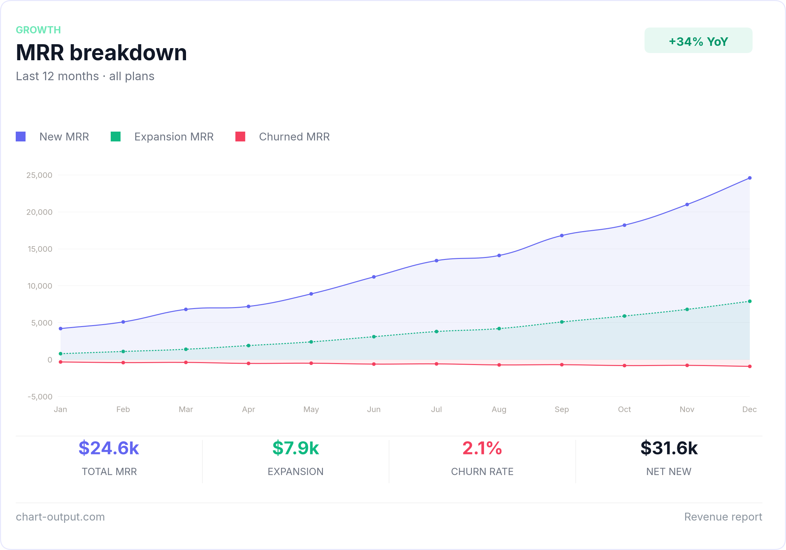

# Chart-Output MCP Server

Render charts as PNG, SVG, or WebP images directly from Claude, Cursor, 
Windsurf, or any MCP-compatible AI agent.

Ask your AI: *"Generate a bar chart showing Q1–Q4 revenue"* — it calls 
Chart-Output and returns the image inline.

## What it produces

Ask your AI agent to generate a chart. This is what comes back.



## Install

Add to your `mcp.json`:

```json
{
  "mcpServers": {
    "chart-output": {
      "command": "npx",
      "args": ["@chartoutput/mcp"],
      "env": {
        "CHART_OUTPUT_API_KEY": "pk_test_YOUR_KEY"
      }
    }
  }
}
```

Get a free API key at [chart-output.com](https://www.chart-output.com/auth/sign-up) 
— no credit card required.

## Tools

| Tool | Description |
|------|-------------|
| `render_chart` | Chart.js spec → inline image in your AI chat |
| `render_chart_url` | Chart.js spec → CDN URL for embedding in email or HTML |
| `render_chart_ai` | Natural language + data → image (Pro/Business key required) |

## Example

Once installed, just ask your AI agent:

> "Create a line chart showing monthly active users growing from 
> 12k in January to 28k in December"

The agent calls `render_chart` or `render_chart_ai` and returns 
the image directly in chat. No code required.

## API Key

1. Sign up at [chart-output.com](https://www.chart-output.com/auth/sign-up)
2. Go to Dashboard → API Keys → Create key
3. Add it to your `mcp.json` as shown above

Free trial includes 500 renders. No credit card required.

## Links

- [Chart-Output docs](https://www.chart-output.com/docs)
- [npm package](https://www.npmjs.com/package/@chartoutput/mcp)
- [Chart-Output pricing](https://www.chart-output.com/pricing)